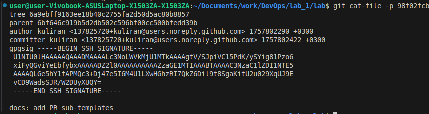
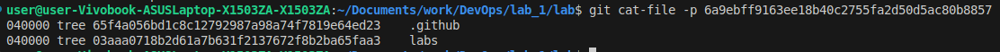
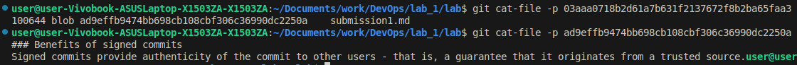
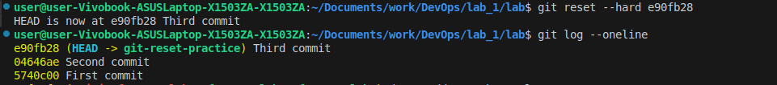
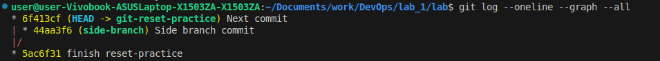
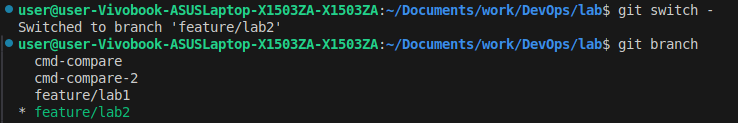
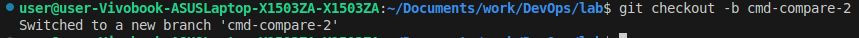
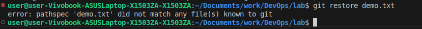
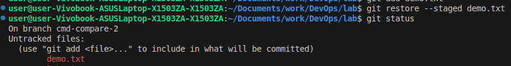
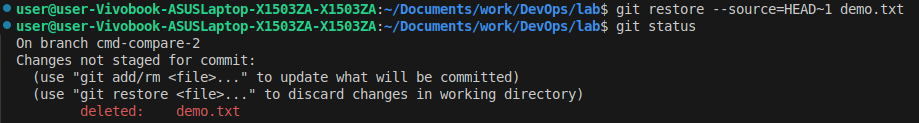

# Task 1
### Get commit hashes:
```bash
git log
```

### View `commit` object data:

- Commits represent saved with `git` 'images', or contents, of a directory in file-system.

### View commit's `tree` object data:

- Trees represent commited directories.

### View `blob` object data:


- Blobs represent commited files.

# Task 2
### Soft reset
```bash
git reset --soft HEAD~1
```
- `HEAD~1` represents a position in `git` history, which takes the position of currently selected branch and goes **1 step back**
- `--soft` flag **moves the discarded changes into staged mode**
- `Third commit` was removed from commit history, but changes were moved into staged mode


### Hard reset
```bash
git reset --hard HEAD~1
```
- `--hard` flag **discards both staged and unstaged changes**, effectively fully resetting to the commit specified
- `Second commit` was removed from commit history, its changes were discarded, and changes for `Third commit` in stage mode were also completely removed. Index is now empty


### Reflog
- Views history of resets and commits that have been made **locally**


### Hard reset to specified commit hash
```bash
git reset --soft 
```
- Now the position is set to a commit hash. It does the same - resets the local repository's state to a specific commit
- Changes of `Second commit` and `Third commit` were brought back. The **removal** of those commits' changes is not staged, because the reset it hard


- Fun fact: I've used `git reset` before, but I often struggled with it, because despite the correct history change, the changes to files would stay the same (unstaged). Turns out, the reset simply should've been `--hard`. Thanks :)

# Task 3
#### After switching back from side branch
```bash
echo "Next commit" >> history.txt
git add history.txt && git commit -m "Next commit"
git log --oneline --graph --all
```

- Graph helps understand where branches originate from. The asterisk `*` shows the initial source level, while commits at the side diverge from it and create their own level

# Task 4
```bash
git tag v1.0.0
git push origin v1.0.0
```
- tag `v1.0.0` points to commit `3f80c83`
- Tags are used to **mark important milestones** in a project's history, such as version releases. Unlike branches, which are designed to move and evolve with new commits, tags **remain fixed** at the commit they were created on.

# Task 5
```bash
git switch -c cmd-compare
```
### Creates a new branch from current commit and switches to it


```bash
git switch -
```
### Switches back to previously checked out branch


```bash
git checkout -b cmd-compare-2
```
### Also creates and switches to a branch


### Restore
```bash
echo "scratch" >> demo.txt
git restore demo.txt
```

- There's an error because there are no commits made with the `demo.txt` file, so `git` cannot restore it to anything

```bash
git add demo.txt
git status
```


```bash
git restore --staged demo.txt
git status
```


- In this case, it is equivalent to `git reset demo.txt`
- `git restore` would work without the `--staged` flag if there was previously a commit containing the `demo.txt` file
- `git restore` is a **convenient way** of choosing a specific file/directory to be **reset back to the previous commit**, rather than stashing changes, resetting, copying the file, popping stash and manually replacing the change!

```bash
git add demo.txt
git commit -m 'add demo'
git restore --source=HEAD~1 demo.txt
```

- In this case, just `git restore demo.txt` would have done the same, but `--source` can be very flexible with distant commits

## Summary
- `git checkout` has functionality of both `switch` and `restore` (with `--`). It is not recommended to use due to confusion
- `git switch` switches to a branch `-c` to create before switching to it
- `git restore` restores a file's state from previous commit (or from specific one, with `--source=`)