# Task 1 - Operating System Analysis
### System Boot Time
```bash
systemd-analyze
```
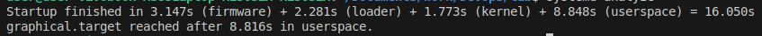
- Outputs the total boot time taken among **topmost logical components**
- **User space** loads for the **longest**

```bash
systemd-analyze blame
```
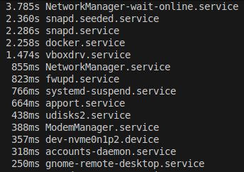
- Outputs all system **modules** and the associated time they took to load
- `plymouth` (boot splash screen) is the slowest
- `NetworkManager-wait-online` waits for network establishment, such as DHCP, DNS, or specific network targets
- `snapd.seeded` automatically refreshes `snap` package data
- `docker` starts Docker daemon + containers

### System Load
```bash
uptime
```
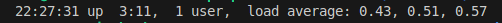
- Prints current time, how long the system has been up, user count and **load** (latest 1, 5, 15 mins)

```bash
w
```
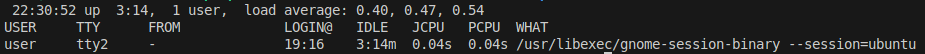
- Shows `uptime` and currently logged in users' info
- `JCPU` - total CPU time by all processes
- `PCPU` - CPU time of current process

### Process Forensics
Identify **resource-intensive** processes:
```bash
ps -eo pid,ppid,cmd,%mem,%cpu --sort=-%mem | head -n 6
```
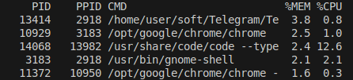
- Sorted by memory consumption
- The messenger takes the most

```bash
ps -eo pid,ppid,cmd,%mem,%cpu --sort=-%cpu | head -n 6
```
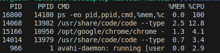
- Sorted by CPU load
- VS Code Editor is currently the most CPU-bound

### Service Dependencies
```bash
systemctl list-dependencies
```
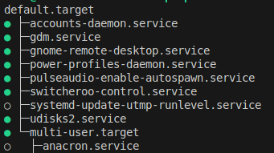
- Lists services running in background and the entities **they are dependent on** (the ones in a branch below)
- Grey indicator means a service is inactive

```bash
systemctl list-dependencies multi-user.target
```
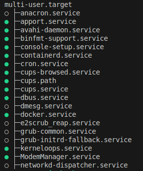
- Shows all entities that must be started to start the `multi-user.target`

### User Sessions
Display info about current users:
```bash
who -a
```
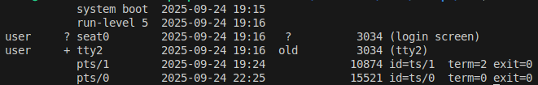
- `system boot` - when was last booted
- `run-level`: 5 - graphical, 3 - multi-user
- latest login time
- also outputs **terminated login sessions** (`exit=0`)

```bash
last -n 5
```
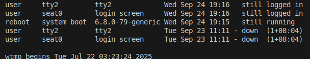
- Outputs noted user login sessions, including down ones

### Memory analysis
Display information about the system's memory usage:
```bash
free -h
```
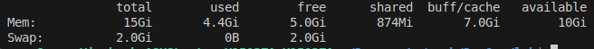
- Also allows to assess system load
- `available` - available for new applications (cache that can be freed)
- `free` - completely unused
- `buff/cache` - used by kernel for I/O caching (can be freed when apps need)
- High `Swap: Used` - critical

```bash
cat /proc/meminfo | grep -e MemTotal -e SwapTotal -e MemAvailable
```


# Task 2
When sharing screenshots of network analysis outputs, it's essential to sanitize **sensitive addresses** including:
- RFC 1918 Private addresses (`10.x.x.x/8`, `172.16.x.x/12`, `192.168.x.x/16`)
- Public addresses of host machines 

Their exposure may lead to **internal network layout** insight for attackers and geolocation disclosure.

### Traceroute Execution
```bash
traceroute github.com |
    sed -E 's/(10\.[0-9]+\.[0-9]+\.)[0-9]+/\1XXX/g'
```
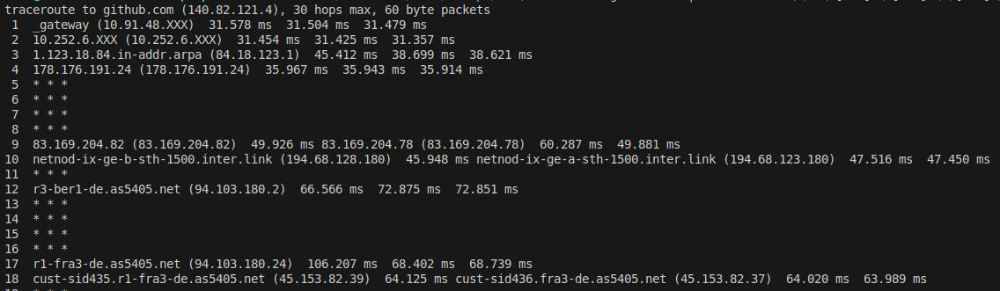
- Shows ip addresses of routers between the calling host machine and the server that gets the request
- `* * *` indicates timeouts, which may be caused by routers being configured not to respond to `traceroute` or firewall operation

### DNS Resolution Check
```bash
dig github.com
```
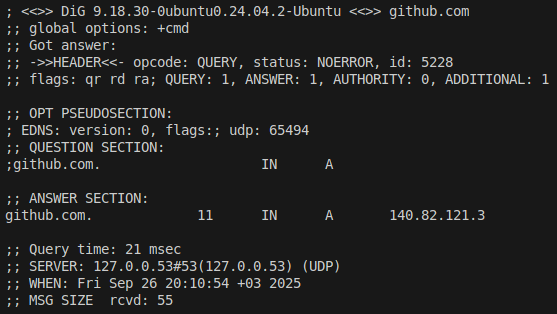
- Shows the ip address of the DNS name, the query time and the ip address of the DNS server used
- The answer is `140.82.121.3`

### Packet Capture
```bash
sudo timeout 10 tcpdump -c 5 -i any 'port 53' -nn |
    sed -E 's/(10\.[0-9]+\.[0-9]+\.)[0-9]+/\1XXX/g'
```
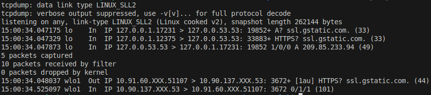
- Listens to DNS traffic to/from the host that the command is run on (`port 53`)
- Doesn't resolve hostnames or port names (`-nn`)
- Includes loopback addresses (`127.*.*.*`)

### Reverse DNS
- If there exists a `PTR` - a match of an ip address to domain name - then Reverse DNS will output the hostname

```bash
dig -x 8.8.4.4
```
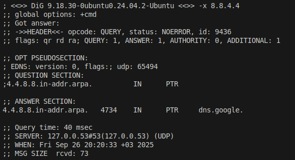
- Performs a **reverse DNS lookup** to get the associated hostname for the ip address (`-x` flag)
- The result is `dns.google`

```bash
dig -x 1.1.2.2
```
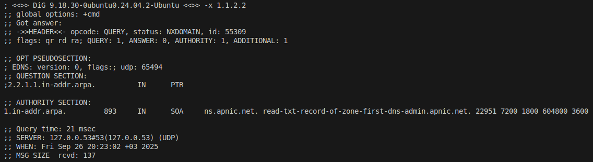
- No `PTR` record exists for `1.1.2.2` - not all ips have reverse DNS configured
- `SOA` (Start of Authority) record shows who manages this ip space

```bash
dig -x 127.0.0.53
```
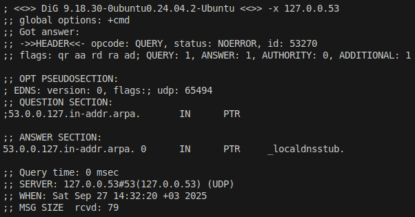
- Answer is `_localdnsstub`